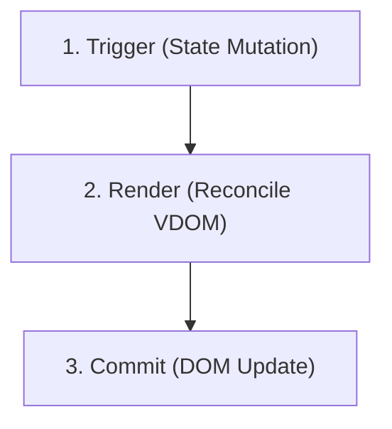

# Introduction

React's declarative paradigm is built on top of a sophisticated render engine that reconciles state changes with the DOM. Instead of managing direct mutations, developers describe *what* the interface should look like, and React computes the necessary updates.

To master performance optimizations, you must understand the distinction between **rendering** and **committing**.

---

# The React Render Loop

The loop consists of three distinct phases:



## 1. Triggering a Render
A render is triggered in two cases:
- It is the component's **initial render**.
- The state of the component (or one of its ancestors) has **changed** via `useState`, `useReducer`, or context updates.

## 2. Rendering the Component
Rendering is React calling your components. During this phase:
- React traverses the component tree.
- It computes the Virtual DOM representation.
- It compares the new representation with the previous one (reconciliation using the Diffing algorithm).

## 3. Committing to the DOM
React modifies the DOM only for nodes that contain changes. 
- For the initial render, React uses the `appendChild()` DOM node API.
- For updates, React applies minimal calculated operations to match the latest Virtual DOM representation.

---

# Render Optimization Rules

### Avoid Ad-hoc Component Definitions
Defining a component inside another component forces React to destroy and rebuild the inner component's state on every single parent render.

```javascript
// ❌ ANTI-PATTERN
function ParentComponent() {
  function InnerComponent() {
    return <div>Slow Render Node</div>
  }
  return <InnerComponent />
}

// ✔ BEST PRACTICE
function InnerComponent() {
  return <div>Fast Reusable Node</div>
}
function ParentComponent() {
  return <InnerComponent />
}
```

### Optimize State Boundaries
Keep state as close to where it is used as possible. Raising state unnecessarily causes larger sub-trees to render during simple updates.
